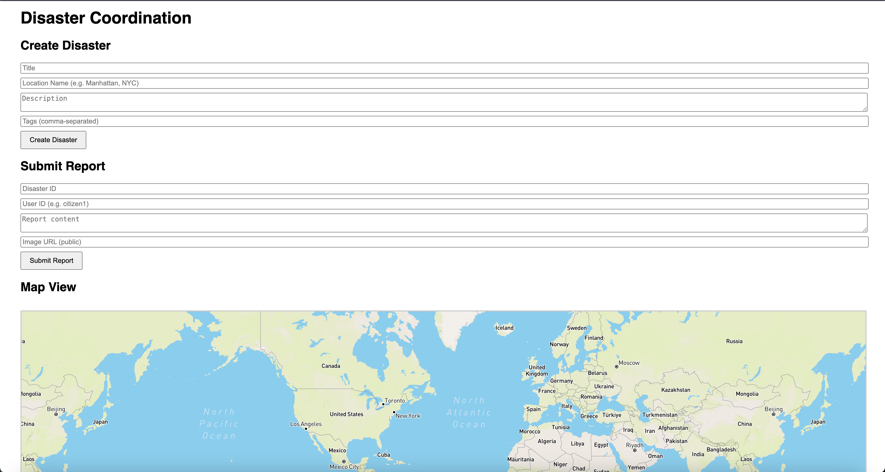

🌍 Disaster Response Coordination Platform
==========================================

A full-stack disaster coordination platform that enables users to report disasters, view real-time updates, verify images using AI, and access geospatial insights through interactive maps.


🛠 TECH STACK
-------------

-   **Frontend:** HTML, JavaScript, CSS, Mapbox GL JS

-   **Backend:** Node.js, Express.js

-   **Database:** Supabase (PostgreSQL + PostGIS)

-   **AI Integration:** Google Gemini API (text location extraction, image verification)

-   **Real-Time:** Socket.IO

-   **Caching:** Supabase cache table

* * * * *

✅ FEATURES IMPLEMENTED
----------------------

### Core Features:

-   Create, view, and manage disaster records with coordinates.

-   Submit user reports with text and image URLs.

-   Extract locations from text using Gemini AI and geocode using Mapbox.

-   Real-time updates using Socket.IO.

-   Interactive Mapbox-based disaster visualization.

### Optional Features:

-   Detect urgent reports with keywords (e.g. "urgent", "SOS").

-   Classify reports into "need", "offer", "alert", or "general".

-   Filter reports using UI buttons by type or priority.

-   Secure Mapbox token fetch via backend (not exposed in frontend).

-   Verify images with Gemini Vision API.


📦 PROJECT STRUCTURE
--------------------


```
disaster-response/
├── backend/
│   ├── routes/
│   ├── config/
│   ├── utils/
│   ├── index.js
│   └── .env
├── frontend/
│   └── index.html
└── .gitignore
```


🔧 BACKEND OVERVIEW
-------------------

The backend is built with **Node.js (Express)** and connects to **Supabase PostgreSQL** with **PostGIS** for geolocation support. It integrates AI and real-time communication.

### Key APIs:

-   `/disasters` -- Create disaster, geocode using Mapbox, extract location via Gemini.

-   `/reports` -- Submit reports, auto-classify (need/offer/alert/general), detect priority.

-   `/geocode` -- Converts location text to coordinates using Mapbox.

-   `/mapbox-token` -- Secure token delivery for frontend without exposing secrets.

### Real-time:

-   Uses Socket.IO to emit `disaster_updated` and `social_media_updated` events.

### AI Integration:

-   **Gemini Text API**: Extracts real-world place names from disaster descriptions.

-   **Gemini Vision API**: Optionally used to verify image authenticity (if configured).

### Caching:

-   Geocode results are cached in Supabase's `cache` table to reduce API calls.

### Environment:

`.env` contains:


```
PORT=4001
SUPABASE_URL=...
SUPABASE_KEY=...
GEMINI_API_KEY=...
MAPBOX_TOKEN=...
```

### Deployment:

Deployed on **Render** with `npm install` and `node index.js`.


💻 FRONTEND OVERVIEW
--------------------

The frontend is a lightweight HTML + JS app that connects to the backend and renders dynamic content with filters and maps.

### Features:

-   Create disasters via form (with tags, title, and description).

-   Submit structured reports with user info, images, and content.

-   Display interactive Mapbox map with real-time disaster markers.

-   Show live disaster and report lists from the backend.

-   Category and priority filter buttons for submitted reports.

### Filtering:

Users can filter by:

-   All

-   ⚠️ Urgent

-   Needs

-   Offers

-   Alerts

### Mapbox Security:

-   Mapbox access token is **not hardcoded**.

-   Token is fetched securely via `/mapbox-token` endpoint.

### Deployment:

Deployed on **Vercel**, configured as:

-   Root: `frontend`

-   Build Command: `none`

-   Output Directory: `frontend`

🧪 SUPABASE SETUP
-----------------

Create the following tables in Supabase:

### `disasters`

-   id (UUID)

-   title

-   location_name

-   location (GEOGRAPHY)

-   description

-   tags (array)

-   created_at

### `reports`

-   id (UUID)

-   disaster_id

-   user_id

-   content

-   image_url

-   verification_status

-   priority (boolean)

-   category

-   created_at

### Other Tables:

-   `resources` (optional)

-   `cache` (for geocode caching)

Enable the **PostGIS extension** and disable RLS for quick testing.


🚀 DEPLOYMENT LINKS
-------------------

-   **Frontend (Vercel):** [Live App](https://disaster-response-g3dvcjeye-subhojit-pauls-projects-0529b500.vercel.app)

-   **Backend (Render):** [API Server](https://disaster-backend-mtev.onrender.com/)

-   **GitHub Repo:** [GitHub Codebase](https://github.com/subhpaul123/disaster-response.git)

💡 Cursor/Windsurf Usage Note
-----------------------------

-   **Cursor AI** was used to generate the initial scaffolding for the backend, including route handlers and service structure.

-   **Windsurf AI** logic was applied to generate mock social media logic and content classifiers used in the `/reports` module.

-   Final classification rules were tuned manually based on Windsurf-generated keyword analysis.